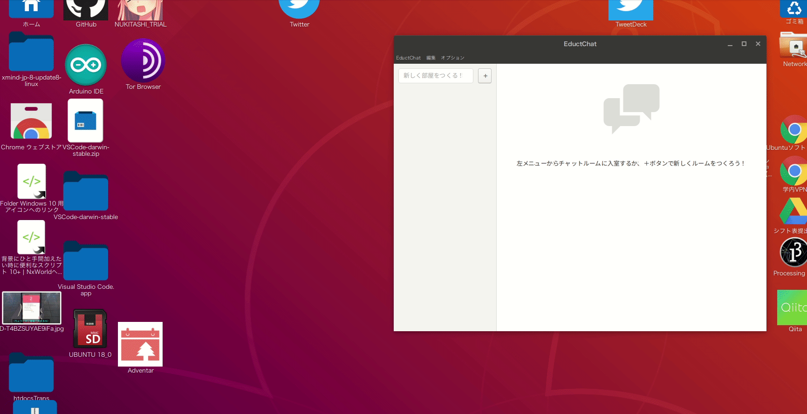
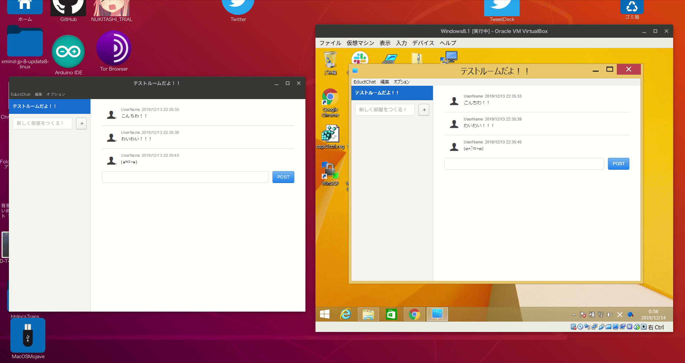

# EductChat

<image src="img/ProjectImage.png">

## EductChatとは??
**Education + Electron + Chat = *EductChat***  
技術評論社の**Electronではじめるアプリ開発 JavaScript/HTML/CSSでデスクトップアプリを作ろう**(野口将人・倉見洋輔 著)の第三章「チャットアプリケーションを作ろう」のコードを一部改変して作ったものです。  
**コピペ、写経が多分に含まれています。**

あの、弊学の演習環境のMacがOS X 10.9のMavericksで、かつChromeやFirefoxなどの  
インストールされているブラウザのバージョンも低く、Slackが使えない状態でした。  
そこで、プログラミングの演習中などに<strong>「これ先生とかTAに聞くほどじゃないけど、  
ここ微妙に理解できている自信がないなぁ……」</strong>というときや、  
<strong>「あれ、あの〇〇ってどうやって使うんだっけ？？」</strong>とかいった時に  
気軽に友達に聞き合えると嬉しいよね！ということで開発しました。

私自信Electronはおろか、**node.jsすらいじったことがない**ので、いろいろ大変です……

まぁなんとかいい感じにVer.1.0.0(ほぼほぼ写経/コピペだけど……)ができたので良かったです……

## インストールのしかた(ソースコードからインストール)
<snap style="font-size: 150%; color: #ff0000;">**インストールにはnode.jsとGoogleアカウントが必要です！！**</snap>  

1. 任意のディレクトリにcloneする
2. `$ cd ./EductChat`で移動して、`$ npm install`を実行しよう！
3. Googleの[Firebaseコンソール](https://console.firebase.google.com/)にアクセスしよう！
   1. 「新規プロジェクトの作成」と書かれているボタンをクリック！プロジェクトを作成しよう！
      - このとき、アナリティクスはオフにしたほうがいいかも！！僕の環境では動かなかったよ！！
   2. 作成したら左側のメニューにある「Authentication」をクリックして「ログイン方法」タブを選択！「メール/パスワード」を有効にして保存しよう！
   3. 左側のメニューからプロジェクトのトップに戻って「ウェブアプリにFirebaseを追加」をクリックしよう！
   4. 出てきたポップアップウインドウに書いてある`const firebaseConfig`で始まるコードをコピーしよう！
   5. 左のメニューからdatabaseをクリックしよう！
   6. 「リアルタイムデータベース」を有効にしよう！
   7. ルールの設定で、読み込みと書き込みを`True`にしよう！
4. 先程コピーしたコードを`{project_root}/src/renderer/app.jsx`にコピーしよう！もともと書いてあるものはコメントアウトするか消してね！
5. もうここまでくれば後少し！`$ npm run watch`を実行しよう！これは止まらないから`^C`で終了してね！
6. 次に`$ npm start`を実行しよう！ここで一通り動作確認をしてね！
7. 上手く動いているようだったらパッケージ化したり自由にしよう！！

## こんな感じに動くよ！！
